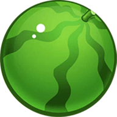

<p align="center">
  <h1 align="center">🐍 果香蛇踪 | Fruity Snake</h1>
  <p align="center">一款基于 Python + Pygame 的现代化贪吃蛇游戏 · 任意角度平滑移动 · 双模式 · 多皮肤</p>

<p align="center">
  
  
  
  
</p>

---

## 📖 目录

- [✨ 功能亮点](#-功能亮点)
- [🎮 游戏演示与截图](#-游戏演示与截图)
- [🏗️ 项目架构](#-项目架构)
- [🚀 快速开始](#-快速开始)
- [🎯 操作指南](#-操作指南)
- [🛠️ 技术细节](#️-技术细节)
- [📁 项目结构](#-项目结构)
- [👥 开发团队](#-开发团队)
- [📄 许可证](#-许可证)

---

## ✨ 功能亮点

### 🎮 游戏模式

| 模式 | 说明 |
|:-----|:-----|
| **无尽模式** | 选择难度后无限游玩，追求最高分 |
| **闯关模式** | 7 个精心设计的关卡，每关有目标分数 |

### 🎚️ 难度系统

- **简单模式** — 适合新手，仅边界墙壁
- **困难模式** — 增加内部障碍物
- **地狱模式** — 复杂迷宫布局，极致挑战

### 🎨 视觉与交互

- **任意角度平滑移动** — 摒弃传统网格跳跃，采用浮点坐标 + 极坐标角度制
- **双皮肤系统** — 黄金小蛇 / 草原绿蟒，各有独立配色方案
- **现代化 UI** — 卡片式布局、渐变背景、粒子效果、发光动画
- **完整音效系统** — BGM + 吃食物 / 加速 / 死亡音效，随场景自动切换

### 🔧 开发调试（按 F 键启用）

| 快捷键 | 功能 |
|:-------|:-----|
| `F1` | 性能监控面板（FPS / 帧时间） |
| `F2` | 动态速度调整 |
| `F3` | 碰撞区域可视化 |
| `F4` | 碰撞检测日志 |
| `M` | UI 显示/隐藏切换 |

---


### 游戏素材预览

| 食物 | 图片 | 蛇皮肤 | 头部预览 |
|:-----|:-----|:-------|:--------|
| 🍎 苹果 (10分) |  | 🐍 黄金小蛇 |  |
| 🍉 西瓜 (20分) |  | 🐍 草原绿蟒 |  |

## 🏗️ 项目架构

本项目采用 **状态机模式 (State Machine)** + **组件化架构**：

```
┌─────────────┐     ┌──────────────────┐     ┌─────────────────┐
│   MainMenu   │ ──▶ │ DifficultySelect  │ ──▶ │  InfiniteMode   │
│   (主菜单)    │     │   (难度选择)       │     │   (无尽模式)     │
└──────┬───────┘     └────────┬─────────┘     └───────┬─────────┘
       │                      │                        │
       ▼                      ▼                        ▼
┌──────────────┐    ┌──────────────┐          ┌──────────────┐
│ SkinSelection │    │  LevelSelect │          │  PauseMenu   │
│  (皮肤选择)   │    │  (关卡选择)   │          │   (暂停菜单)  │
└──────┬───────┘    └──────┬───────┘          └──────────────┘
       │                   │
       ▼                   ▼
                  ┌─────────────────┐
                  │    LevelMode     │
                  │   (闯关模式)      │
                  │  7个关卡目标分数  │
                  └────────┬────────┘
                           │
              ┌────────────┼────────────┐
              ▼            ▼            ▼
        LevelPause   LevelComplete  LevelGameOver
```

### 核心组件

| 组件 | 文件 | 职责 |
|:-----|:-----|:-----|
| 🐍 Snake | `components/snake.py` | 平滑移动引擎、路径追踪跟随、24方向头部渲染、加速特效 |
| 🍎 Food | `components/food.py` | 多类型食物生成、智能避让碰撞、权重随机分配 |
| 🧱 Wall | `components/wall.py` | 程序化砖墙纹理、JSON地图加载、圆形碰撞检测 |
| 🎵 SoundManager | `utils/sound_manager.py` | 音频预加载、无缝循环、多通道独立控制 |
| 🖼️ ImageManager | `utils/image_manager.py` | 自动资源发现、标准化处理流水线、缓存管理 |
| 🔤 FontManager | `utils/font_manager.py` | 8档预设字号、自定义TTF字体、文本渲染封装 |

---

## 🚀 快速开始

### 环境要求

- **Python** >= 3.7
- **Pygame** >= 2.0
- **操作系统**: Windows / Linux / macOS

### 安装依赖

```bash
# 克隆项目
git clone https://github.com/your-username/fruity-snake.git
cd 贪吃蛇

# 安装核心依赖
pip install pygame

# 可选：图片预处理工具依赖
pip install Pillow numpy
```

### 运行游戏

```bash
cd snake_game
python main.py
```

---

## 🎯 操作指南

### 基本操控

| 按键 | 功能 |
|:-----|:-----|
| `W` / `↑` | 向上转向 |
| `S` / `↓` | 向下转向 |
| `A` / `←` | 向左转向 |
| `D` / `→` | 向右转向 |
| `Space` | 加速移动（2倍速 + 视觉特效） |
| `Esc` / `P` | 暂停 / 继续游戏 |

### 食物与计分

| 食物 | 分数 | 出现概率 |
|:-----|:----:|:--------|
| 🍎 苹果 | 10 分 | 高 |
| 🍉 西瓜 | 20 分 | 低 |

---

## 🛠️ 技术细节

### 平滑移动系统（核心创新）

与传统贪吃蛇的网格跳跃不同，本项目实现了真正的 **任意角度连续平滑移动**：

```
坐标系统：浮点坐标系 (float x, float y)
转向机制：极坐标角度制（弧度 → 三角函数分解）
         vx = cos(angle) × speed
         vy = sin(angle) × speed

身体跟随：路径追踪算法（Path Tracing）
         - 记录蛇头历史路径点 + 累积距离
         - 每段身体在路径上按固定间距插值定位
         - 保证身体段之间距离恒定、运动连贯

头部渲染：24帧预渲染（每15°一帧），运行时最近邻取图
自适应转向：角度差越大转向越快（最高2倍速），小角度(<15°)直接到位
```

### 碰撞检测

- **圆形碰撞检测**：所有实体（蛇头/食物/墙壁）均使用半径检测，适配浮点坐标
- **自身碰撞容错**：从第4节身体开始检测，避免误判
- **三种碰撞独立开关**：墙壁碰撞 / 自身碰撞 / 边界碰撞

### 数据驱动配置

难度和关卡均通过 **JSON 文件** 配置，支持轻松扩展：

```
configs/
├── difficulty/
│   ├── easy.json      # 简单模式地图 (40×30 网格)
│   ├── hard.json      # 困难模式地图
│   └── hell.json      # 地狱模式地图
└── level/
    ├── level_01.json  ~ level_07.json  # 7个关卡配置
```

每个 JSON 包含：地图二维数组、蛇初始位置/方向/速度、食物生成区域、游戏规则参数。

### 设计模式

| 模式 | 应用场景 |
|:-----|:---------|
| **状态机 (State Machine)** | 游戏界面切换（14种状态） |
| **单例 (Singleton)** | Config / SoundManager / FontManager / ImageManager |
| **工厂方法 + JSON Loader** | 难度/关卡配置加载 |
| **观察者模式** | 事件分发（输入→状态→组件） |

---

## 📁 项目结构

```
贪吃蛇/
├── docs/                                  # 文档与媒体资源
│   └── 运行视频.mp4                       # 游戏运行演示视频
├── docx/                                  # 项目文档目录
│   ├── 创新.png                           # 创新点说明图
│   ├── 状态流程图.png                     # 游戏状态流转图
│   └── 贪吃蛇技术文档/                     # 技术深度文档
├── snake_game/                            # 主程序包
│   ├── main.py                            # 程序入口
│   ├── assets/                            # 资源文件
│   │   ├── graphics/                      # 图片资源
│   │   │   ├── food/                      # 食物图片 (苹果/西瓜)
│   │   │   ├── snake/                     # 蛇皮肤图片
│   │   │   │   ├── snake0/                # 皮肤0: 黄金小蛇
│   │   │   │   └── snake1/                # 皮肤1: 草原绿蟒
│   │   │   └── ui/                        # UI素材 (预留)
│   │   ├── sound/                         # 音效文件
│   │   │   ├── main.mp3                   # 主菜单BGM
│   │   │   ├── run_background.mp3         # 游戏BGM
│   │   │   ├── eat.mp3                    # 吃食物音效
│   │   │   ├── high_speed.mp3             # 加速音效
│   │   │   └── game_over.mp3              # 游戏结束音效
│   │   └── te.py                          # 图片预处理工具脚本
│   ├── resources/
│   │   └── font/
│   │       └── font_1.ttf                 # 自定义中文字体
│   └── src/                               # 核心源代码
│       ├── game.py                         # Game主控制器 / 状态机调度
│       ├── components/                     # 游戏核心组件
│       │   ├── snake.py                   # 蛇类 (平滑移动引擎)
│       │   ├── food.py                    # 食物类 + 管理器
│       │   └── wall.py                    # 墙壁类 + 管理器
│       ├── configs/                        # 配置模块
│       │   ├── config.py                  # 全局配置单例
│       │   ├── game_balance.py            # 游戏平衡性参数
│       │   ├── skin_config.py             # 皮肤颜色配置
│       │   ├── difficulty_loader.py       # 难度JSON加载器
│       │   ├── level_loader.py            # 关卡JSON加载器
│       │   ├── difficulty/                # 难度配置数据 (JSON)
│       │   └── level/                     # 关卡配置数据 (JSON)
│       ├── states/                         # 游戏状态机 (UI界面)
│       │   ├── base_state.py              # 状态基类
│       │   ├── main_menu.py               # 主菜单
│       │   ├── difficulty_selection.py    # 难度选择
│       │   ├── skin_selection.py          # 皮肤选择
│       │   ├── level_selection.py         # 关卡选择
│       │   ├── infinite_mode.py           # 无尽模式游戏逻辑
│       │   ├── level_mode.py              # 闯关模式游戏逻辑
│       │   ├── pause_menu.py              # 暂停菜单
│       │   ├── game_over_menu.py          # 结束菜单
│       │   ├── level_pause_menu.py        # 闯关暂停菜单
│       │   ├── level_game_over.py         # 闯关结束菜单
│       │   ├── level_loading.py           # 关卡加载画面
│       │   └── level_state_manager.py     # 关卡状态管理器
│       └── utils/                          # 工具模块
│           ├── tools.py                   # 图片处理工具集
│           ├── font_manager.py            # 字体管理器 (单例)
│           ├── image_manager.py           # 图片管理器 (单例)
│           ├── sound_manager.py           # 声音管理器 (单例)
│           ├── grid_utils.py              # 网格工具类
│           └── performance_monitor.py     # 性能监控器
├── LICENSE                                # MIT 许可证
├── COPYRIGHT_NOTICE.md                    # 版权声明
└── README.md                              # 本文件
```

---

## 👥 开发团队

| 成员 | 贡献领域 |
|:-----|:---------|
| **高正杰** | 游戏主控 & 底层逻辑 / 平滑移动引擎 / 美术设计 |
| **乔碧** | 游戏运行流程 & 模块调用 / UI交互设计 / 美术设计 |
| **李亚婷** | 游戏运行流程 & 模块调用 / 美术设计 |

> 联系方式: 3085678256@qq.com

---

## 📄 许可证

本项目基于 [MIT License](LICENSE) 开源。

© 2025 "果香蛇踪"游戏开发团队 版权所有

---

<p align="center">
  <sub>Built with ❤️ using Python & Pygame</sub>
</p>
